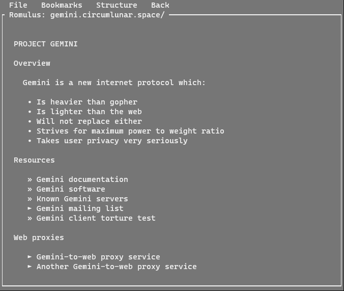
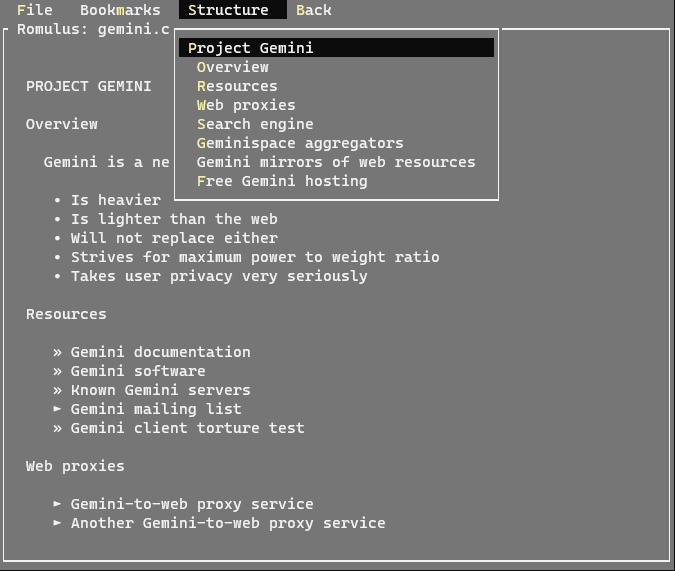

# Romulus

A cross platform Gemini console client in C# with a simple user interface.

# Usage

```
Romulus <url>
```

# Features

* Interactive menus
* Mouse support, including wheelmouse scrolling for consoles that support it
* Monochrome yet beautiful gemtext rendering, by using whitespace and layout to indicate the page elements and structure. 
* Fixes vertical spacing between elements for a global homogenous gemtext style
* Pretty text rendering, including hanging bullets, nice quotations and the like
* Interactive table of contents for each page
* Fast history navigation, including remembering page offset
* Bookmark support

# Screenshots

Gemini home page



Menu showing the structure of a page



# Download

A binary download for Windows x64 is available on https://www.marmaladefoo.com/pages/romulus

# Building

Romulus is a .NET Core C# application, so it should be able to be compiled on the supported platforms, including Windows and Linux.

Romulus uses the [SmolNetSharp](https://github.com/LukeEmmet/SmolNetSharp) library  which should be checked out into a sibling folder, for example

```
Projects
└─Romulus
└─SmolNetSharp
```
Romulus uses the Gui.cs console library

https://github.com/migueldeicaza/gui.cs

# Known issues

* Windows Terminal does not yet support mouse - use standard command shell
* Linux shell - on returning from application control characters may be send to the shell on mouse moving (fix: start a new shell instance)

# Feedback

* send feedback to: luke @ marmaladefoo . com

